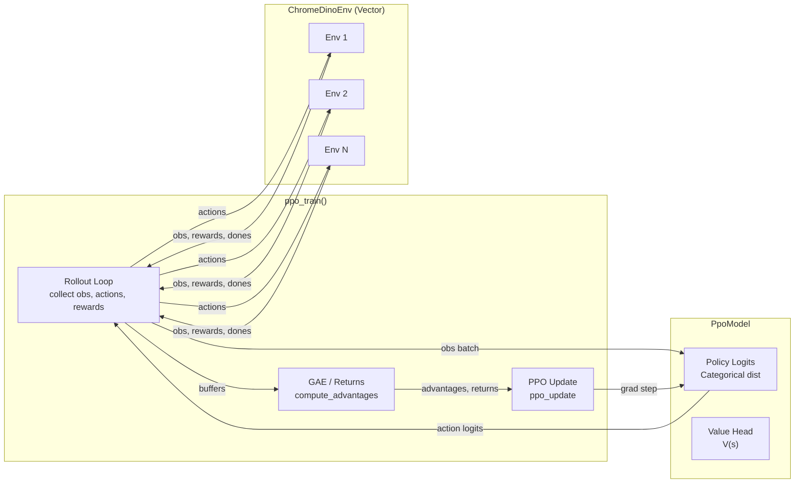

<p align="center">
  
  <h2 align="center" style="margin-top: -4px !important;">Play or train a Chrome Dino runner agent</h2>
</p>

## What is this?

A lightweight Python/PyGame remake of the Chrome offline dinosaur game. You can play it manually or train an RL agent that learns to dodge obstacles automatically.

## Project structure

```bash
chrome-dino-runner/
├── assets/                # Sprites and images
├── figures/               # Game character modules
├── game/                  # Shared game settings/state
├── utilities/             # Helpers (env factory, obs normalizer)
├── chrome_dino.py         # Playable game
├── chrome_dino_env.py     # Gymnasium environment
├── train_dino_agent.py    # PPO training script
├── test_env.py            # Evaluation script
└── requirements.txt
```

## Setup

```bash
git clone https://github.com/LadinaM/chrome-dino-runner.git
cd chrome-dino-runner
pip install -r requirements.txt
```

## Run the game

If you want to play the original game, run it with the following command:

```bash
python chrome_dino.py
```

**Controls**

| Keys        | Action          |
|-------------|-----------------|
| Any key     | Start           |
| ↑           | Jump            |
| ↓           | Duck            |
| p / ESC     | Pause           |
| u           | Unpause         |

## Train the RL agent

- Start training (uses PPO with an auto-curriculum):
  ```bash
  python train_dino_agent.py
  ```
- Monitor with TensorBoard:
  ```bash
  tensorboard --logdir=./pt_logs --port=6006 --bind_all
  ```
  Open http://localhost:6006
- Evaluate a trained policy:
  ```bash
  python test_env.py
  ```

**CLI options**

- `train_dino_agent.py` (selected flags):
  - `--total-timesteps`: total environment steps to train (default 10_000_000)
  - `--n-envs`, `--n-steps`: vectorized env count and rollout length
  - `--lr`, `--clip-coef`, `--vf-coef`, `--ent-coef`, `--gae-lambda`, `--gamma`, `--max-grad-norm`: PPO knobs
  - `--hidden`: hidden layer width
  - `--vec-backend`: `async` (default) or `sync`
  - `--log-dir`, `--save-path`: output locations
  - `--minibatch-size`, `--update-epochs`: optimization batch/epochs
  - `--torch-compile`: enable torch.compile
  - `--no-linear-lr`, `--no-norm-obs`: disable LR decay or obs normalization
  - `--no-auto-curriculum`: disable multi-phase curriculum and use single-phase knobs (`--frame-skip`, `--speed-increases`, rewards/penalties caps)

- `test_env.py`:
  - `--model`: path to a `.pt` checkpoint or run directory (default: latest run under `--log-dir`)
  - `--log-dir`: where training runs are stored (default `./pt_logs`)
  - `--ckpt-name`: checkpoint filename to look for (default `dino_ppo.pt`)
  - `--episodes`: number of eval episodes (default 5)
  - `--device`: `cuda` or `cpu`
  - `--max-episode-steps`: per-episode step cap
  - `--speed-increase`: enable speed ramping during eval

For full hyperparameters, curriculum logic, or reward shaping details, check `train_dino_agent.py` and `chrome_dino_env.py`.

## What is happening in the background for the RL part

The training loop `ppo_train()` method is the orchestrator. It builds vectorized `ChromeDinoEnv`instances via `make_env()`, steps them to collect rollouts and feeds observations into the model. 

